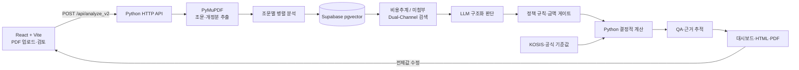

<div align="center">

# ORCA

### 법안 PDF에서 근거를 추적할 수 있는 비용추계서 초안까지

LLM의 문서 해석, 유사 사례 검색, 정책 규칙, 결정적 계산을 분리한
법안·조례안 비용추계 지원 시스템입니다.

[](https://github.com/toranan/Cost-Estimate/actions/workflows/ci.yml)
[](https://www.python.org/)
[](https://react.dev/)
[](https://supabase.com/)
[](./LICENSE)

[제품 흐름](#제품-흐름) · [아키텍처](#아키텍처) · [검증](#검증-현황) · [기여 범위](#프로젝트-맥락과-기여-범위) · [실행](#로컬-실행)

</div>


## 프로젝트 한눈에 보기

| 구분 | 내용 |
|---|---|
| 문제 | LLM 단독 비용추계의 근거 없는 가정, 산술 오류, 결과 검증의 어려움 |
| 입력 | 텍스트가 포함된 법안·조례안 PDF |
| 출력 | 조문별 재정수반 판단, 유사 선례와 출처, 5개년 비용 초안, 공식 양식 문서 |
| 핵심 설계 | 문서 해석은 LLM, 검색은 RAG/TAG, 정책 보정과 계산은 Python |
| 사용자 검토 | 전제값을 수정하면 서버가 연도별 금액과 분류 기준을 재계산 |
| 현재 단계 | 포트폴리오용 기능 검증 프로토타입. 실제 행정 의사결정에는 전문가 검토 필요 |

ORCA는 “LLM이 추계서를 대신 작성한다”보다 **AI가 만든 초안을 사람이 검증하고 수정할 수 있게 만드는 것**에 초점을 둡니다.

## 제품 흐름

1. 사용자가 법안 또는 조례안 PDF와 적용 양식을 선택합니다.
2. PDF 본문과 신구조문대비표에서 개정 조문을 구조화합니다.
3. 각 조문을 유사 비용추계서와 미첨부 사유서 두 채널에서 검색합니다.
4. LLM 판단을 법정 금액 기준과 도메인 규칙으로 보정하고, Python이 비용을 계산합니다.
5. 사용자는 판단 근거와 전제값을 검토하고 수정한 뒤 문서를 내려받습니다.

<table>
  <tr>
    <td width="50%"></td>
    <td width="50%"></td>
  </tr>
  <tr>
    <td align="center">PDF 업로드와 국회·지자체 양식 선택</td>
    <td align="center">관련 조문과 5개년 산식이 포함된 결과 문서</td>
  </tr>
</table>

## 핵심 엔지니어링

### 1. 생성과 계산의 책임 분리

LLM은 조문의 의미, 비용유발 후보, 필요한 변수를 구조화합니다. 확정된 변수의 곱셈·복리·연도별 합계는 [`calculator.py`](./backend/calculator.py)가 수행합니다.

이 분리는 **산술 과정의 재현성**을 높이지만 전체 결과의 정확성을 보장하지는 않습니다. 잘못 추출된 변수와 부적절한 가정은 근거 추적, QA 리포트, 사용자 검토로 다룹니다.

### 2. 비용추계와 미첨부 사례의 Dual-Channel 검색

초기 버전은 비용이 발생하는 선례만 검색해, 조직 규모가 시행령에 위임된 법안도 임의 금액으로 산출했습니다. 이를 해결하기 위해 같은 조문 임베딩으로 두 종류의 문서를 함께 검색합니다.

```text
조문 임베딩
├─ 비용추계서 채널: 산식과 전제값 후보
└─ 미첨부 사유서 채널: 기술적 추계 곤란 선례
```

산출 가능한 조문이 하나라도 있으면 해당 부분만 추계하는 **존재 게이트**를 결합해, 단순 다수결이 일부추계를 막지 않도록 했습니다.

### 3. 근거 추적과 Human-in-the-loop

각 전제값에는 KOSIS, 구조화 선례(TAG), 사용자 입력 등 출처를 기록합니다. 값이 없을 때 임의로 확정하지 않고 `missing_vars` 또는 검토 필요 상태로 노출하며, 사용자가 값을 수정하면 `/api/recompute`가 결과를 다시 계산합니다.

현재 구현은 **검토와 재계산 단계의 HITL**입니다. 수정 이력을 학습 데이터로 자동 반영하는 폐쇄형 피드백 루프는 아직 구현하지 않았습니다.

## 아키텍처



| 설계 결정 | 선택 이유 | 현재 트레이드오프 |
|---|---|---|
| LLM과 계산 엔진 분리 | 산술 오류와 재계산 불일치 축소 | 변수 추출·가정 선택 오류는 별도 검증 필요 |
| 조문 단위 병렬 처리 | 외부 API 대기시간 단축 | rate limit과 부분 실패 정책 필요 |
| pgvector HNSW | 4만여 문서 청크의 의미 검색 | 임계값과 청킹 정책이 결과에 큰 영향 |
| Base64 JSON 업로드 | MVP 구현과 Vercel 연결 단순화 | 파일 크기 증가, 동기 요청 시간 제한 |
| 표준 라이브러리 HTTP 서버 | 작은 API 표면과 의존성 최소화 | 인증·스키마 검증·관측성은 제품화 전에 보강 필요 |

상세 데이터 흐름, DB 스키마, 응답 구조는 [ARCHITECTURE.md](./ARCHITECTURE.md)에 정리했습니다.

## 검증 현황

현재 공개한 수치는 **성능 벤치마크가 아니라 개발 과정의 회귀 테스트 스냅샷**입니다.

| 검증 항목 | 현재 결과 | 해석 |
|---|---:|---|
| 공식 문서 방향 비교 | 8건 중 8건 일치 | 비용추계서/미첨부 방향의 소규모 회귀 확인 |
| 금액 산출 사례 | 4건 | 3건은 공식 금액 대비 1% 이내, 1건은 전제 차이로 21% 오차 |
| 계산·정책 단위 테스트 | 23개 통과 | 계산, 양식, 일부 정책 회귀를 로컬에서 검증 |
| 프론트엔드 | ESLint + Vite build | 정적 검사와 프로덕션 번들 생성 |

> 평가 대상과 동일한 공식 문서가 검색 풀에 포함될 수 있어 현재 결과를 엄격한 holdout 성능으로 해석하면 안 됩니다. 다음 평가는 `bill_id`와 시간 기준으로 검색 인덱스를 분리하고, 분류 F1·금액 MAPE·근거 Top-k hit rate를 독립적으로 측정할 계획입니다.

오답을 구조 결함과 데이터 부족으로 나누어 개선한 과정은 [Engineering Log](./docs/IMPROVEMENTS.md), 면접용 설계 맥락과 트레이드오프는 [Engineering Case Study](./docs/ENGINEERING_CASE_STUDY.md)에서 볼 수 있습니다.

## 프로젝트 맥락과 기여 범위

이 프로젝트는 동국대학교 컴퓨터공학과 캡스톤·산학협력 과제로 시작했습니다. 현재 개인 포트폴리오 저장소에서는 안승원이 다음 영역을 중심으로 유지·고도화하고 있습니다.

- PDF 입력부터 RAG/TAG, 정책 판정, 계산, 문서 출력까지 end-to-end 파이프라인 통합
- Python 계산 엔진과 양식별 금액 게이트, 유사 선례 기반 전제값 처리
- React 결과 대시보드, 근거 모달, 전제값 수정·재계산, PDF 출력 UX
- 실제 NABO 문서와의 오답 비교, 회귀 사례 기록, 검색·판정 구조 개선
- 생성형 AI를 구현 보조 도구로 활용하고, 중간 JSON·검색 결과·테스트로 생성 코드를 검증

커밋 이력은 팀 저장소 병합 이후의 개인 고도화 과정도 함께 보존합니다. 구현 범위와 남은 기술 부채는 과장 없이 문서에 구분했습니다.

## 기술 스택

| 영역 | 기술 |
|---|---|
| Frontend | React 19, Vite 8, JavaScript, CSS |
| Backend | Python, `ThreadingHTTPServer`, PyMuPDF |
| AI | Gemini, OpenAI/Azure OpenAI Embeddings |
| Retrieval | Supabase PostgreSQL, pgvector, HNSW |
| Data | 국회 Open API, KOSIS Open API |
| Output | HTML, PDF, DOCX, HWPX renderer |
| Deployment | Vercel serverless configuration |

## 로컬 실행

### 요구 사항

- Python 3.12 이상
- Node.js 20.19 이상 또는 22.13 이상
- npm

### 설치

```bash
git clone https://github.com/toranan/Cost-Estimate.git
cd Cost-Estimate

python3 -m venv .venv
source .venv/bin/activate
pip install -r requirements.txt

cp backend/.env.example backend/.env
cp frontend/.env.example frontend/.env.local

cd frontend
npm ci
cd ..
```

`backend/.env`에 필요한 API 키를 설정합니다. 전체 RAG 분석을 재현하려면 데이터가 적재된 Supabase 프로젝트가 필요하며, 원본 데이터와 비밀 키는 저장소에 포함하지 않습니다.

### 개발 서버

터미널 1:

```bash
python3 -m backend.server
# http://127.0.0.1:8000
```

터미널 2:

```bash
cd frontend
npm run dev
# http://127.0.0.1:5173
```

### 검증

```bash
python3 -m unittest backend.test_formula_engine

cd frontend
npm run lint
npm run build
```

## 저장소 구조

```text
.
├─ api/                         # Vercel Python 진입점
├─ backend/
│  ├─ analyzer_v2.py            # 메인 분석 파이프라인
│  ├─ assembly_*                # 정책·산식·선례 엔진
│  ├─ calculator.py             # 결정적 연도별 계산
│  ├─ server.py                 # HTTP API 라우팅
│  ├─ scripts/                  # 수집·청킹·임베딩·평가 도구
│  └─ supabase_schema.sql       # RAG/TAG 스키마
├─ frontend/                    # React + Vite UI
├─ docs/
│  ├─ assets/                   # 제품 이미지
│  ├─ IMPROVEMENTS.md           # 오답 진단과 회귀 기록
│  ├─ ENGINEERING_CASE_STUDY.md # 설계 결정·기여·기술 부채
│  └─ planning/                 # 초기 기획과 진행 기록
├─ ARCHITECTURE.md              # 상세 아키텍처
└─ README.md                    # 제품·실행·검증 요약
```

## 알려진 한계와 다음 단계

- 스캔 PDF OCR 미지원
- 소규모 회귀 세트만 존재하며 엄격한 holdout 평가가 필요
- 날짜 치환·준용 조문처럼 본문 의미가 얇은 의안은 제안이유·조문 제목 기반 보강 검색이 필요
- 조세지출의 최신 실적처럼 부처 제출자료가 필요한 값은 선례 근사치와 사용자 입력을 명확히 구분해야 함
- 동기 Base64 업로드를 객체 스토리지 + 비동기 작업 큐 + 진행 상태 API로 전환 필요
- 인증, 고객별 데이터 격리, rate limit, 감사 로그는 프로덕션 적용 전 필수
- 프론트엔드의 큰 단일 컴포넌트를 기능별 컴포넌트와 typed API layer로 분리 필요

## 문서

- [상세 아키텍처](./ARCHITECTURE.md)
- [엔지니어링 케이스 스터디](./docs/ENGINEERING_CASE_STUDY.md)
- [오답 진단과 개선 기록](./docs/IMPROVEMENTS.md)
- [Supabase 스키마](./backend/supabase_schema.sql)
- [Frontend 가이드](./frontend/README.md)

## 라이선스

[MIT License](./LICENSE)
