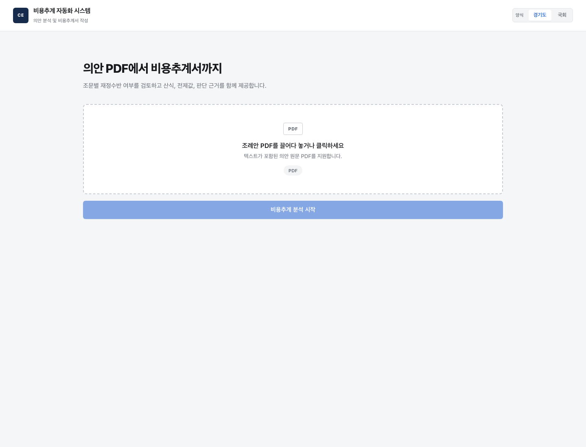
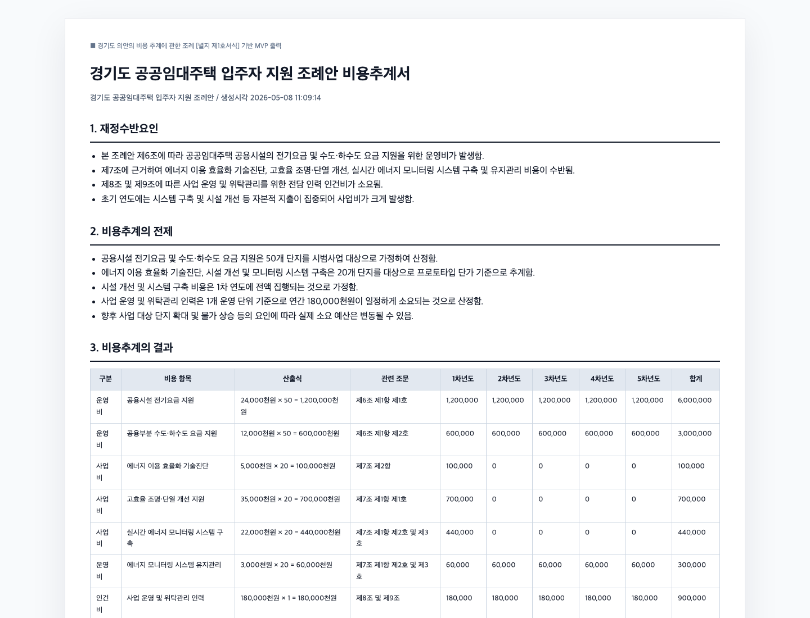
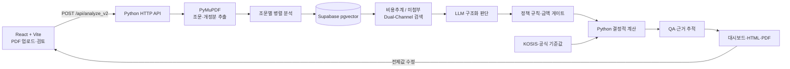

<div align="center">

# ORCA

### 법안 PDF에서 근거를 추적할 수 있는 비용추계서 초안까지

LLM의 문서 해석, 유사 사례 검색, 정책 규칙, 결정적 계산을 분리한
법안·조례안 비용추계 지원 시스템입니다.

[](https://github.com/toranan/Cost-Estimate/actions/workflows/ci.yml)
[](https://www.python.org/)
[](https://react.dev/)
[](https://supabase.com/)
[](./LICENSE)

[제품 흐름](#제품-흐름) · [문제 해결](#오답을-구조-개선으로-바꾼-과정) · [검증](#타깃-제외-홀드아웃-검증) · [아키텍처](#아키텍처) · [기여 범위](#프로젝트-맥락과-기여-범위) · [실행](#로컬-실행)

</div>



## 프로젝트 한눈에 보기

| 구분 | 내용 |
|---|---|
| 문제 | LLM 단독 비용추계의 근거 없는 가정, 산술 오류, 결과 검증의 어려움 |
| 입력 | 텍스트가 포함된 법안·조례안 PDF |
| 출력 | 조문별 재정수반 판단, 유사 선례와 출처, 5개년 비용 초안, 공식 양식 문서 |
| 핵심 설계 | 문서 해석은 LLM, 검색은 RAG/TAG, 정책 보정과 계산은 Python |
| 사용자 검토 | 근거가 없는 필수 변수만 요청하고, 입력 즉시 Python으로 5개년 금액을 재계산 |
| 데이터 | 국회 문서 43,964 청크 + 구조화 비용추계 1,378건 + 전제값 풀 |
| 검증 | 분석 대상 의안 제외 4건, 모두 금액 오차 20% 이내, MAPE 11.2%, 근거 누출 0건 |
| 현재 단계 | 포트폴리오용 기능 검증 프로토타입. 실제 행정 의사결정에는 전문가 검토 필요 |

ORCA는 “LLM이 추계서를 대신 작성한다”보다 **AI가 만든 초안을 사람이 검증하고 수정할 수 있게 만드는 것**에 초점을 둡니다.

## 제품 흐름

1. 사용자가 법안 또는 조례안 PDF와 적용 양식을 선택합니다.
2. PDF 본문과 신구조문대비표에서 개정 조문을 구조화합니다.
3. 각 조문을 유사 비용추계서와 미첨부 사유서 두 채널에서 검색합니다.
4. LLM 판단을 법정 금액 기준과 도메인 규칙으로 보정하고, Python이 비용을 계산합니다.
5. 사용자는 판단 근거와 전제값을 검토하고 수정한 뒤 문서를 내려받습니다.

<table>
  <tr>
    <td width="50%"></td>
    <td width="50%"></td>
  </tr>
  <tr>
    <td align="center">PDF 업로드와 국회·지자체 양식 선택</td>
    <td align="center">관련 조문과 5개년 산식이 포함된 결과 문서</td>
  </tr>
</table>

## 핵심 엔지니어링

### 1. 생성과 계산의 책임 분리

LLM은 조문의 의미, 비용유발 후보, 필요한 변수를 구조화합니다. 확정된 변수의 곱셈·복리·연도별 합계는 [`calculator.py`](./backend/calculator.py)가 수행합니다.

이 분리는 **산술 과정의 재현성**을 높이지만 전체 결과의 정확성을 보장하지는 않습니다. 잘못 추출된 변수와 부적절한 가정은 근거 추적, QA 리포트, 사용자 검토로 다룹니다.

### 2. 비용추계와 미첨부 사례의 Dual-Channel 검색

초기 버전은 비용이 발생하는 선례만 검색해, 조직 규모가 시행령에 위임된 법안도 임의 금액으로 산출했습니다. 이를 해결하기 위해 같은 조문 임베딩으로 두 종류의 문서를 함께 검색합니다.

```text
조문 임베딩
├─ 비용추계서 채널: 산식과 전제값 후보
└─ 미첨부 사유서 채널: 기술적 추계 곤란 선례
```

산출 가능한 조문이 하나라도 있으면 해당 부분만 추계하는 **존재 게이트**를 결합해, 단순 다수결이 일부추계를 막지 않도록 했습니다.
조직·시설처럼 규모가 미정인 사건은 유사도 점수만으로 미첨부를 결정하지
않습니다. 현재 계산에 부족한 변수 역할과 과거 공식 미첨부 사유의 누락
역할이 일치할 때만 계산을 보류하고 HITL 근거를 요청합니다.

### 3. 근거 추적과 Human-in-the-loop

각 전제값에는 KOSIS, 구조화 선례(TAG), 사용자 입력 등 출처를 기록합니다. 값이 없을 때 임의로 확정하지 않고 `missing_vars` 또는 검토 필요 상태로 노출하며, 사용자가 값을 수정하면 `/api/recompute`가 결과를 다시 계산합니다.

현재 **검토와 재계산 단계의 HITL**을 구현했습니다. 사용자가 확정한
위원회 변수는 공식 TAG와 분리된 로컬 JSONL 큐에 `pending review` 상태로
축적됩니다. 검토 전에는 검색 근거로 쓰거나 DB에 자동 업로드하지 않으며,
나중에 한 번에 검수·적재할 수 있습니다.

## 오답을 구조 개선으로 바꾼 과정

특정 정답 금액에 맞추는 보정값을 추가하지 않고, 오답이 만들어진 단계를 찾아 같은 유형에 적용되는 구조를 바꾸었습니다.

| 관찰된 실패 | 원인 | 일반화한 개선 |
|---|---|---|
| 분석 대상의 정답 추계서가 유사사례로 검색됨 | 의안 단위 holdout 부재 | 현재 `bill_no`를 RAG·TAG·전제값 풀 전체에서 제외 |
| 존재하지 않는 지원비·인건비가 자연스럽게 추가됨 | LLM 초안을 산식 항목으로 신뢰 | 항목 주장을 대응 조문으로 역검증하는 grounding gate 추가 |
| 위원회 설치·구성 조문이 두 개 비용으로 합산됨 | 조문이 달라도 같은 실체·산식 유형 | `cost family + article/entity`를 기준으로 정규화하고 중복 제거 |
| 유사사례 2건만 보고 회의횟수를 판단해 결과가 흔들림 | UI 표시 후보와 통계 표본을 동일시 | 주제 매칭이 약하면 현재 의안을 뺀 공식 코퍼스 119건의 분포를 사용 |
| 근거가 없는데도 위원회 400만 원·연 2회 등이 자동 채워짐 | 편의성을 위한 family-wide fallback | 평면 기본값을 제거하고 미확정 변수만 HITL로 전환 |

예를 들어 국립대학병원 의안은 최초 4,300만 원으로 과소추계됐습니다.
단순히 금액을 올리지 않고 중복 위원회·누락된 5년 주기 계획·근거 없는
지원 항목을 각각 바로잡았습니다. 최신 엔진은 조문에 있는 위원회와 주기적
계획만 남기고 1억 7,700만 원을 산출했습니다(공식 1억 6,100만 원,
오차 +9.9%).

## 타깃 제외 홀드아웃 검증

아래는 개발 과정에서 사용한 소규모 회귀 세트입니다. 각 실행에서 **분석 대상 의안의 공식 추계서를 모든 검색·전제값 후보에서 제외**했고, 결과 JSON의 `evidence_leak=false`를 확인했습니다.

| 의안 | 공식 총액 | ORCA | 오차율 | 주요 산식 |
|---|---:|---:|---:|---|
| 친환경농어업법 (2214559) | 120백만 원 | 140백만 원 | +16.7% | 위원회 회의수당 |
| 국립대학병원법 (2126334) | 161백만 원 | 177백만 원 | +9.9% | 위원회 + 5년 주기 계획수립 |
| 특별지방자치단체법 (2213937) | 49,811백만 원 | 48,637.4백만 원 | -2.4% | 조직 인력·운영비 |
| 법원조직법 (2213969) | 12,094백만 원 | 11,975.6백만 원 | -1.0% | 조직 승격·증원 |
| 헌법특별위원회 (2126636) | 8,847백만 원 | 9,175.3백만 원 | +3.7% | 조직 신설 + HITL 순증인원 |
| 공공기관 담당관 (2126655) | 4,356백만 원 | 4,467.9백만 원 | +2.6% | 인력비 + HITL 순증인원 |
| 공무원보수위원회 (2125736) | 55백만 원 | 56백만 원 | +1.8% | 조문 인원 − HITL 기존인원 |

**요약:** 최신 Solar Pro2 회귀 7건 모두 사례별 허용오차를 통과했고,
금액 MAPE는 약 5.4%, 검색 대상 누출은 0건입니다. 외부 현황값이 없는
3건은 해당 값만 명시적 HITL 입력으로 분리했습니다.

> 이 결과는 오답을 관찰하며 구조를 개선한 **target-excluded 개발 holdout**이지, 처음 보는 대규모 데이터에서의 블라인드 성능 보증은 아닙니다. 보다 엄격한 평가는 시간·의안 단위로 독립 테스트 세트를 분리해야 합니다.

HITL 검토 큐는 다음 명령으로 DB 업로드 전 검토 파일만 생성할 수 있습니다.
이 명령 자체는 외부 DB에 연결하지 않습니다.

```bash
python3 -m backend.scripts.export_hitl_feedback
```

평가 조건, 의안별 산식, 오답을 보고도 금액을 맞추지 않은 이유는 [Evaluation](./docs/EVALUATION.md)에 정리했습니다.

## 아키텍처



| 설계 결정 | 선택 이유 | 현재 트레이드오프 |
|---|---|---|
| LLM과 계산 엔진 분리 | 산술 오류와 재계산 불일치 축소 | 변수 추출·가정 선택 오류는 별도 검증 필요 |
| 조문 단위 병렬 처리 | 외부 API 대기시간 단축 | rate limit과 부분 실패 정책 필요 |
| pgvector HNSW | 4만여 문서 청크의 의미 검색 | 임계값과 청킹 정책이 결과에 큰 영향 |
| Base64 JSON 업로드 | MVP 구현과 Vercel 연결 단순화 | 파일 크기 증가, 동기 요청 시간 제한 |
| 표준 라이브러리 HTTP 서버 | 작은 API 표면과 의존성 최소화 | 인증·스키마 검증·관측성은 제품화 전에 보강 필요 |

상세 데이터 흐름, DB 스키마, 응답 구조는 [ARCHITECTURE.md](./ARCHITECTURE.md)에 정리했습니다.

## 프로젝트 맥락과 기여 범위

이 프로젝트는 동국대학교 컴퓨터공학과 캡스톤·산학협력 과제로 시작했습니다. 현재 개인 포트폴리오 저장소에서는 안승원이 다음 영역을 중심으로 유지·고도화하고 있습니다.

- PDF 입력부터 RAG/TAG, 정책 판정, 계산, 문서 출력까지 end-to-end 파이프라인 통합
- Python 계산 엔진과 양식별 금액 게이트, 유사 선례 기반 전제값 처리
- React 결과 대시보드, 근거 모달, 전제값 수정·재계산, PDF 출력 UX
- 실제 NABO 문서와의 오답 비교, 타깃 제외 홀드아웃, 검색·판정·산식 구조 개선
- 평면 기본값 제거, 전제값 출처 추적, 필수 변수만 요청하는 Human-in-the-loop 설계
- 생성형 AI를 구현 보조 도구로 활용하고, 중간 JSON·검색 결과·테스트로 생성 코드를 검증

커밋 이력은 팀 저장소 병합 이후의 개인 고도화 과정도 함께 보존합니다. 구현 범위와 남은 기술 부채는 과장 없이 문서에 구분했습니다.

## 기술 스택

| 영역 | 기술 |
|---|---|
| Frontend | React 19, Vite 8, JavaScript, CSS |
| Backend | Python, `ThreadingHTTPServer`, PyMuPDF |
| AI | Gemini, OpenAI/Azure OpenAI Embeddings |
| Retrieval | Supabase PostgreSQL, pgvector, HNSW |
| Data | 국회 Open API, KOSIS Open API |
| Output | HTML, PDF, DOCX, HWPX renderer |
| Deployment | Vercel serverless configuration |

## 로컬 실행

### 요구 사항

- Python 3.12 이상
- Node.js 20.19 이상 또는 22.13 이상
- npm

### 설치

```bash
git clone https://github.com/toranan/Cost-Estimate.git
cd Cost-Estimate

python3 -m venv .venv
source .venv/bin/activate
pip install -r requirements.txt

cp backend/.env.example backend/.env
cp frontend/.env.example frontend/.env.local

cd frontend
npm ci
cd ..
```

`backend/.env`에 필요한 API 키를 설정합니다. 전체 RAG 분석을 재현하려면 데이터가 적재된 Supabase 프로젝트가 필요하며, 원본 데이터와 비밀 키는 저장소에 포함하지 않습니다.

### 개발 서버

터미널 1:

```bash
python3 -m backend.server
# http://127.0.0.1:8000
```

터미널 2:

```bash
cd frontend
npm run dev
# http://127.0.0.1:5173
```

### 검증

```bash
python3 -m unittest backend.test_formula_engine

cd frontend
npm run lint
npm run build
```

## 저장소 구조

```text
.
├─ api/                         # Vercel Python 진입점
├─ backend/
│  ├─ analyzer_v2.py            # 메인 분석 파이프라인
│  ├─ assembly_*                # 정책·산식·선례 엔진
│  ├─ calculator.py             # 결정적 연도별 계산
│  ├─ server.py                 # HTTP API 라우팅
│  ├─ scripts/                  # 수집·청킹·임베딩·평가 도구
│  └─ supabase_schema.sql       # RAG/TAG 스키마
├─ frontend/                    # React + Vite UI
├─ docs/
│  ├─ assets/                   # 제품 이미지
│  ├─ IMPROVEMENTS.md           # 오답 진단과 회귀 기록
│  ├─ EVALUATION.md             # 타깃 제외 4건 평가
│  ├─ ENGINEERING_CASE_STUDY.md # 설계 결정·기여·기술 부채
│  └─ planning/                 # 초기 기획과 진행 기록
├─ ARCHITECTURE.md              # 상세 아키텍처
└─ README.md                    # 제품·실행·검증 요약
```

## 현재 범위와 확장 계획

- **문서 입력:** 텍스트 레이어 PDF를 안정적으로 처리하며, 다음 단계로 스캔 PDF OCR을 연결합니다.
- **평가:** target-excluded 4건 회귀를 완료했고, 시간 기준 독립 테스트 세트로 확장할 계획입니다.
- **운영:** 현재 동기 프로토타입을 객체 스토리지·비동기 큐·진행 상태 API로 확장할 수 있습니다.
- **제품화:** 인증·고객 데이터 격리·감사 로그와 typed API layer를 추가해 운영 안정성을 높일 계획입니다.

## 문서

- [상세 아키텍처](./ARCHITECTURE.md)
- [엔지니어링 케이스 스터디](./docs/ENGINEERING_CASE_STUDY.md)
- [오답 진단과 개선 기록](./docs/IMPROVEMENTS.md)
- [타깃 제외 4건 평가](./docs/EVALUATION.md)
- [포트폴리오(위원회 TAG 룰엔진 케이스 스터디)](./포트폴리오/README.md)
- [TAG 룰엔진 성과 케이스 스터디(검증된 숫자·동적 DB 조회·프런티어 모델 교차검증)](./포트폴리오/CASE_STUDY.md)
- [Supabase 스키마](./backend/supabase_schema.sql)
- [Frontend 가이드](./frontend/README.md)

## 라이선스

[MIT License](./LICENSE)
